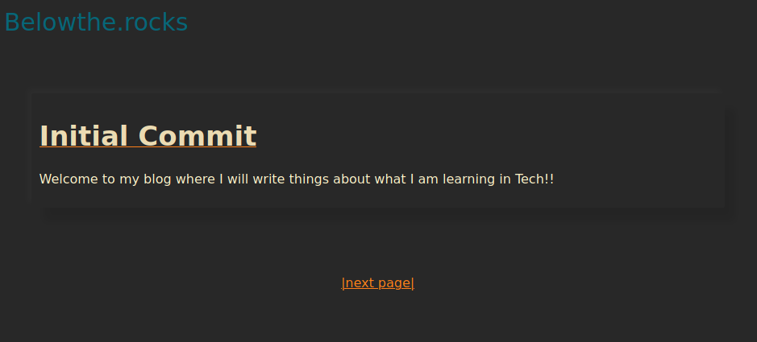

slug = "creating-blog"
title = "Creating this blog (1)"
date = "2021-07-17 07:30:00"
===

In 2019, I have been busy coding everything in Python for my work and for my small projects.
Then I have found someone did the glorious RIIR, rewrite it in rust, for the Python interpreter [RustPython](https://github.com/RustPython/RustPython).
I thought "Why would you rewrite something that already work in another langauge?"
"Also, what is this Rust language that I have never heard of? Maybe I should check it out!."

After visiting Rust homepage and installing the compiler, I went straight to the hello world tutorial.
The code was very simple. Although, I didn't really understand that `println!` was a macro (And what is with the exclamation sign!).

Later, I finished reading [The Book](https://doc.rust-lang.org/book/). It was a smooth ride and I enjoyed the book very much.
It is when I fell in love with Rust language. It is like a more verbose version of Python, but it is also a low-level language.
Not to mentioned to the other benifit of Rust language such as memory safety, zero-cost abstraction, and etc.

Then I tried to extend the hands-on project from The Book, [web server](https://doc.rust-lang.org/book/ch20-00-final-project-a-web-server.html).
I made [smol-webhook](https://doc.rust-lang.org/book/ch20-00-final-project-a-web-server.html), which is simply as the name implies, a small webhook server.
I had fun writing it, although it is definitely not a good code. And I have been using it for continuous integration for my websites.

At this point, you may wonder "What do all of these have to do with the blog?"
Yes, they all have to do with my inspiration of making the blog from scratch by myself.
Not too long after I chose Rust, I have encountered this [blog post](https://fasterthanli.me/articles/a-new-website-for-2020).
The blog post really inspired me to create a blog system by myself.

Actually forget the word "from scratch", the blog uses many wonderful libraries that I couldn't appreciate more.
I use:
* `tide` and `async-std` for the web-serving.
* `liquid` for the templating.
* `fern`, `this-error`, `color-eyre` for the lovely logging.
* `pulldown-cmark` for parsing markdown syntax to html.
* and more in the `Cargo.toml`

Here is a snapshot of the current state of the blog.

The blog is very simple. It just shows the entries with a simple paging.
For the implementation details, I will left it for the blog post in the future.

"What? after all this introduction!?"

In the meantime, this blog repository can be found [here](https://github.com/zynaxsoft/belowtherocks).

So this brings me to the end of the blog (how?). I don't really know if this post could be a matrial for something.
I just feel like I want to write something on this blog, since I just created and left it empty almost a year ago.

Any comments would be greatly appreciated!
You can reach me at Twitter @tanapoldev
Pardon my English. See you on the next blog post.
